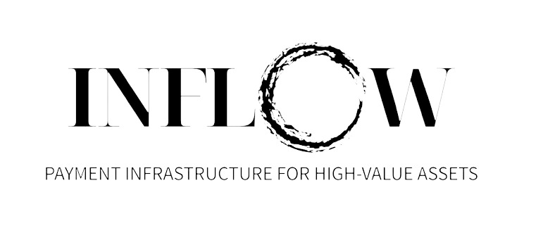

# Pay With Inflow - ETHGlobal IST 2023 🇹🇷🐈‍⬛🐈🧑‍💻

## Next gen Decentralized Payment Infrastructure for high value assets

# Table of Contents

1. [Description](#description)
2. [Contracts](#contracts)

## Description

This project is focus on change the paradygm of account abstraction using instead being focus on onboarding, we'll be more concentrate on the why and create the how around that. With this Inflow offers seamless web3 payment experience where web2 users can buy high value assets (raffle shoes from collabs, new luxury brands and even pieces of arts). (web2) Users can buys for instance a bored ape yatch watch, with inflow it will :

- Init the interaction between the real world and blockchain through `Arx`
- Set up their their smart accounts
- On ramp through `unlimit` that is sent in the address
- Atomic swap from some ETH in APECOIN with `1inch fusion` + `ERC-4337` Standards
- Send the transaction to the seller sponsored by our `BAYCPaymaster Contract` that will be payed in ERC20 APECOIN

<u>In a single click !!!</u>

## Contracts

### [GOERLI] ✅ (verified)

[0x26fdfd62ba753981acc8c7e1a4530c2daaf2a9ad](https://goerli.etherscan.io/address/0x26fdfd62ba753981acc8c7e1a4530c2daaf2a9ad)  
[0x3174ef9ff60eb69a196b98a4c88b1455c285eec8](https://goerli.etherscan.io/address/0x3174ef9ff60eb69a196b98a4c88b1455c285eec8)  
[0x1618030d7b466e0290a20576f7a8bb90ca97782d](https://goerli.etherscan.io/address/0x1618030d7b466e0290a20576f7a8bb90ca97782d)  
[0x43281a23de4F0280A267B440e7b4Cba87679f530](https://goerli.etherscan.io/address/0x43281a23de4F0280A267B440e7b4Cba87679f530)  

### [arbitrum sepolia] 🔄 (not verified)

zapper address 0x096e527a20aFd13C1D42280594b083e22a460FE2  
WalletFactory address 0x080083e504f21f7d919c275c666559d0BE94764E  
wallet 0xa2eC24FeF160c0f47533179757A0c868fD7D5df6  
BAYCPaymaster address 0x884211c70D63dc25F25152233B2fDfdf685f638e  

### [Linea testnet] 🔄

zapper address 0xd0D328F8a9D79DC5cf5c33D7944Ff0da809397DA  
WalletFactory address 0x58d8423BFd366b595ad833a8E943249902e43131  
wallet 0xFC83087671741956C79E5c3e5682767F0D1250c6  
BAYCPaymaster address 0x44C14d92323AA4fdF2f55a0A281fb80BeedEA45F  

### [Scroll testnet] 🔄

zapper address 0xa193dCaA901aeA09d24F79EcC3F8b6A7Dc539e96  
WalletFactory address 0xaD226670A640DbBE71b3efe669c1fB8617b1e826  
wallet 0xb146c2E51d9D2f201a7Ee4626d1dF6a5a7334CeB  
BAYCPaymaster address 0x8303c1A5CBa73c0D27da32A9e13DCaC2819605D2  

### [Mantle testnet] 🔄

zapper address 0xA51e1C5D2C186a7B8c3677B74556b5d13974638C  
WalletFactory address 0x01fD771f69a06a1E99e7a6e9aeb7978B44a42093  
wallet 0xA950983c979d71260018c290B51a19eF2932Dc3F  
BAYCPaymaster address 0x7C822a79dC1E8dC38c14e92853c17Cb3CabFDB62  

### [Celo alfajores] 🔄

zapper address 0xdB099B30057BaAE5D2E41549899B75dd1373Ce59  
WalletFactory address 0x9e77571ec54832CFC4Bdd7A6a12CFC0A3078F75b  
wallet 0xDA45242f94399Bc499Bc3C65cfd3f6E68b8FA8ee  
BAYCPaymaster address 0x9509c6F6c7CEc0BA84f7E19AaFCD20A1020AA702  

### [Base Goerli] 🔄

zapper address 0xa193dCaA901aeA09d24F79EcC3F8b6A7Dc539e96  
WalletFactory address 0xaD226670A640DbBE71b3efe669c1fB8617b1e826  
wallet 0xb146c2E51d9D2f201a7Ee4626d1dF6a5a7334CeB  
BAYCPaymaster address 0x8303c1A5CBa73c0D27da32A9e13DCaC2819605D2  
